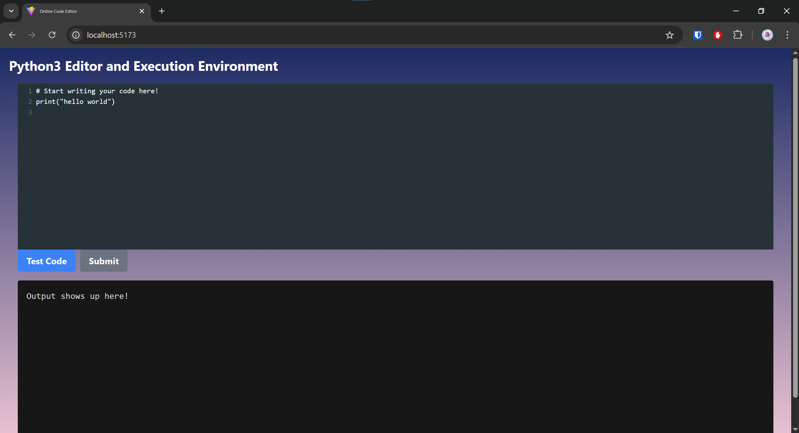

# Online Code Editor

This full-stack web application allows users to edit, run, and save code. 

I created this mainly to get a first experience with React + TypeScript and was a bit of a challenge because I have not touched even Javascript before this project, but overall it was fun to learn and experiment with :).

## How to Setup
1. Initialize the frontend: Navigate to `OnlineCodeEditor/frontend` and run `npm run dev`. This may require the installation of the following dependencies: [react-codemirror2, tailwind]
2. Initialize the backend: Navigate to `OnlineCodeEditor/backend` and run `fastapi dev main.py`. This may require the installation of the following dependencies: [fastapi, aiosqlite]
3. Initialize the docker image: Navigate to `OnlineCodeEditor/backend` and run `docker build -t code_executor .`
4. Navigate to http://localhost:5173/, and play around!
